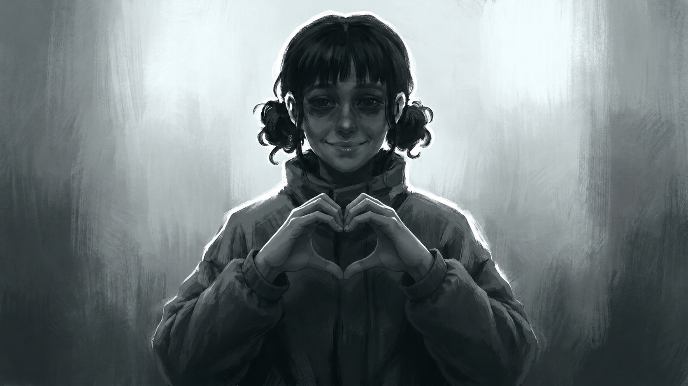

# Дизайн-документация игры «Баргый: Путь сквозь Лёд»



Директория содержит весь визуальный продакшен игры: референсы персонажей, концепт-арты бестиария, фоны локаций и покадровые раскадровки сцен. Каждая подпапка — это набор артов (`PNG` + исходники `JPEG`) и сопроводительное описание (`.md`).

---

## 🧑 1_PERS — Персонажи

| # | Папка | Персонаж | Роль | Арт |
|---|-------|----------|------|:---:|
| 1 | `1_Aisen` | **Айсен** | Главный герой, мальчик 10 лет | ✅ |
| 2 | `2_Kyn` | **Кюннэй** | Сестра Айсена, 8 лет | ✅ |
| 3 | `3_Bargyy` | **Баргый** | Якутская лайка, пёс-спутник | ✅ |
| 4 | `4_Ebe` | **Бабушка Эбэ** | Хранительница знаний | ✅ |
| 5 | `5_Uda` | **Удаганка** | Белая Шаманка (Эмээхсин) | ❌ |
| 6 | `6_Djul` | **Дьулусхан** | Проводник к финалу | ❌ |
| 7 | `7_Otes` | **Отец** | Голос отца | ❌ |

**Форматы в каждой папке:** `PNG/` — готовые арты · `JPEG/` — исходники · `*.md` — описание/референс

---

## 👹 2_BESTIA — Бестиарий (монстры, боссы, антагонисты)

| # | Папка | Сущность | Сцена | Арт |
|---|-------|----------|:----:|:---:|
| 1 | `1_TONGUS_HARAH` | **Тонгус Харах** · Мерзлый Глаз | 1 | ✅ |
| 2 | `2_KYULYUK_SYURYUK` | **Кюлюк Сююрюк** · Теневой Бегун | 2 | ✅ |
| 3 | `3_YTYYR_UU` | **Ытыыр Уу** · Плачущая Вода | 4 | ✅ |
| 4 | `4_TIMIR_TIIS` | **Тимир Тиис** · Железный Зуб | 5 | ❌ |
| 5 | `5_HARA_SANDAL` | **Хара Сандал** · Чёрный Трон | 6 | ❌ |
| 6 | `6_SYUYULYUKKE` | **Сююлюккэ** · Мясник | 7 | ❌ |
| 7 | `7_OYBON_KUTURUK` | **Ойбон Кутурук** · Водоворот Разума | 8 | ❌ |
| 8 | `8_UGUYAR_TYYN` | **Угуйар Тыын** · Зовущий Дух | 9 | ❌ |
| 9 | `9_10_11_PERVYE` | **Первые Абаасы** · Три древние сущности | 10 | ❌ |
| 10 | `12_SERDTSE` | **Сердце Тьмы** · Финальный босс | 10 | ❌ |

---

## 🏔️ 3_FON — Фоны локаций

| # | Папка | Локация | Сцена | Арт |
|---|-------|---------|:----:|:---:|
| 1 | `1_DOM_BABUSHKI` | Дом бабушки — интерьер | 1 | ✅ |
| 2 | `2_POSELOK` | Посёлок — вид из окна | 1 | ✅ |
| 3 | `3_PRORUB` | Прорубь — место встречи с Тонгусом | 1 | ❌ |
| 4 | `4_LABIRINT` | Лабиринт — владения Теневого Бегуна | 2 | ❌ |
| 5 | `5_TENEVOY_KARMAN` | Теневой Карман — сердце лабиринта | 2 | ❌ |
| 6 | `6_LEDYANAYA_RAVNINA` | Ледяная Равнина — путь к юрте | 3 | ❌ |
| 7 | `7_YURTA_SHAMANKI` | Юрта Шаманки — место инициации | 3 | ❌ |
| 8 | `8_PESCHERA_SLYOZ` | Пещера Слёз — владения Ытыыр Уу | 4 | ❌ |
| 9 | `9_KUZNECHNYY_ZAL` | Кузнечный Зал — владения Тимир Тиис | 5 | ❌ |
| 10 | `10_ZAL_SUDA` | Зал Суда — владения Хара Сандала | 6 | ❌ |
| 11 | `11_PESCHERA_KOSTEY` | Пещера Костей — владения Мясника | 7 | ❌ |
| 12 | `12_KRAY_VODOVOROTA` | Край Водоворота — владения Ойбон Кутурук | 8 | ❌ |
| 13 | `13_TEMNITSA_PREDKA` | Темница Предка — владения Угуйар Тыын | 9 | ❌ |
| 14 | `14_CHERTOGI_PERVYKH` | Чертоги Первых — тронный зал | 10 | ❌ |
| 15 | `15_SERDTSE_TMY` | Сердце Тьмы — финальная локация | 10 | ❌ |

---

## 🎬 4_RASKADROVKA — Раскадровки сцен

Покадровые визуальные сценарии — каждый `NN.md` содержит описание реплик, ракурсов и переходов для соответствующей сцены. Арты лежат в `NN_PNG/` и `NN_JPEG/`.

| # | Папка | Сцена | Арт |
|---|-------|-------|:---:|
| 1 | `01` | **Сцена 1** · Пурга — пролог, дом бабушки, встреча с Тонгус Харахом | ✅ 13 кадров |
| 2 | `02` | **Сцена 2** · Теневой Бегун — лабиринт, погоня, встреча с Кюлюк Сююрюк | ✅ 12 кадров |
| 3 | `03` | **Сцена 3** · Белая Шаманка — ледяная равнина, юрта, инициация | ❌ |
| 4 | `04` | **Сцена 4** · Плачущая Вода — пещера, исцеление, встреча с Ытыыр Уу | ❌ |

---

## 📊 Общая статистика

| Раздел | Всего | Готово | Ожидает |
|--------|:-----:|:------:|:-------:|
| Персонажи | 7 | 4 | 3 |
| Бестиарий | 10 | 3 | 7 |
| Фоны | 15 | 2 | 13 |
| Раскадровки | 4 | 2 | 2 |
| **Итого** | **36** | **11** | **25** |

---

## 🗂️ Структура папок с артом

Каждая папка персонажа/монстра, где есть арт, содержит:

```
ИМЯ_ПАПКИ/
├── ИМЯ.md          ← описание, референс, заметки художника
├── PNG/            ← готовые файлы для движка
│   ├── *_og.png    ← основной арт (original)
│   ├── *_emo.png   ← эмоциональный вариант (emotion)
│   └── *_setka.png ← вариант с сеткой (разметка эмоций/поз)
└── JPEG/           ← исходники (большой размер, без сжатия)
```

**Типы артов:**
- **`OG`** (Original) — основной концепт-арт
- **`EMO`** (Emotion) — лист эмоций / варианты выражения
- **`SETKA`** (Grid) — разметка пропорций / поз
- **`EX`** (Extra) — дополнительные варианты / эксперименты
- **`UPSCALE`** — увеличенная версия (для фонов)
